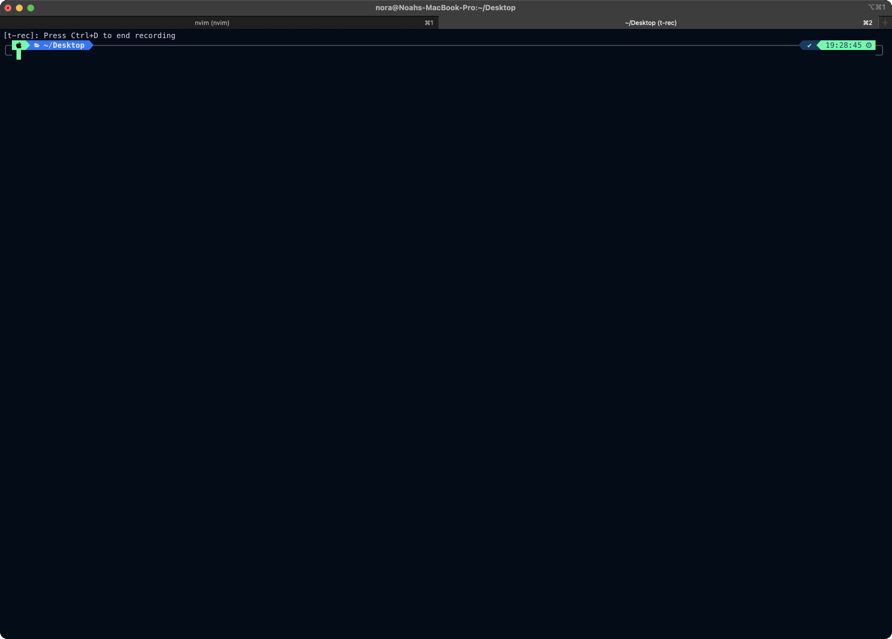

# byteblitz

<p align="center">


</p>
<p align="center" style="font-weight: bold;">
a command-line tool for viewing the binary content of files in different formats. 
</p>
 
<p align="center">
     <a href="https://github.com/noahra/byteblitz"></a>
      &nbsp;
     <a href="https://github.com/noahra/byteblitz">
</a>
      &nbsp;
      <a href="https://github.com/noahra/byteblitz">
</a>

</p>

<br>

## Installation

On macOS/Linux, if you are using [Homebrew](https://brew.sh/)

```bash
brew install noahra/homebrew-byteblitz/byteblitz
```

On Windows, if you are using [Scoop](https://scoop.sh)

```bash
scoop bucket add scoop-byteblitz https://github.com/noahra/scoop-byteblitz && scoop install byteblitz
```

## Usage

```bash
byteblitz <file> 
```

If you want to view values (values larger than a single byte) in little endian format you can use the following environment variable.

```bash
LITTLE_ENDIAN=1 byteblitz <file> 
```

## byteblitz in action ✨

You can switch between different formats.

<br><br>

<br><br>
You can scroll through the values inside the file.
<br><br>

You can even interpret values in little-endian format
<br><br>

